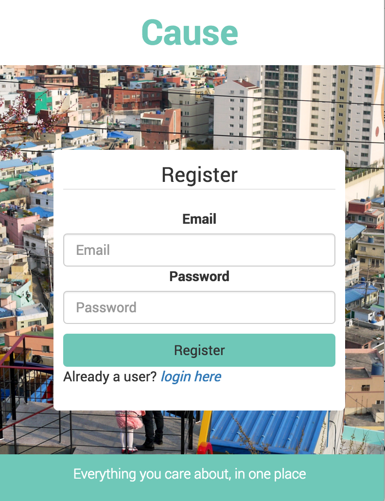
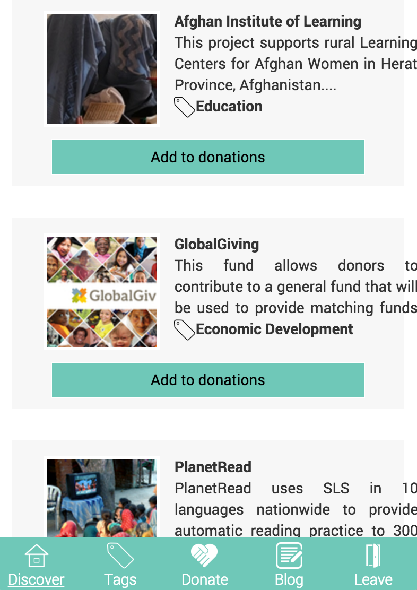
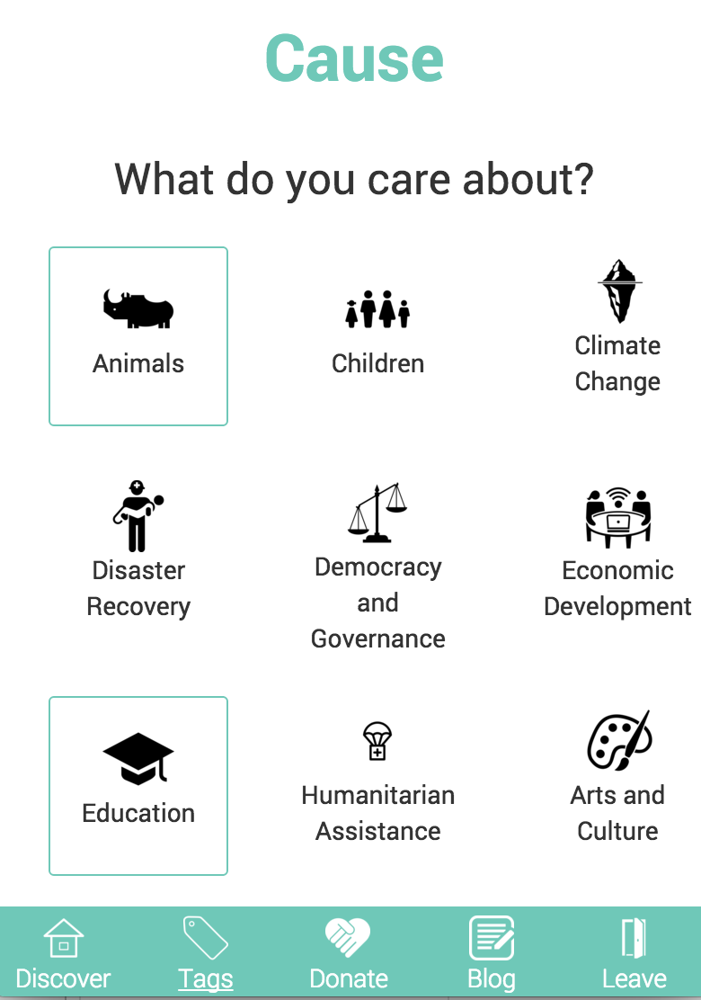

# Cause

###GA WDI London - Project 4

####A charity project finder and donation app

#####[View it here!](https://cause-app.herokuapp.com/ "Here!")

####The App

Users can sign up, login, and search for projects based on what they care about. The user can select multiple projects with which they choose to donate. In the future I plan to fully include the donation aspect of the application, however currently this is not possible within the application.

####The build

* Built with Node, Express & MongoDB 
* Front-end in AngularJs
* Global Giving API & Google Maps API
* The Google Web Font 'Roboto' has been used to style the app.

#### Problems & Challenges

My main issue when building this application was finding and using a suitable API to consume. I first chose the just giving API however soon realised it did not offer sufficient data to build a great application from, for this reason I moved to the GlobalGiving API. Another issue I faced whilst building this app, was integrating Google Maps API, as it needs to initialize when the page loads. As my map div is not visible when the app first starts, this caused some errors.